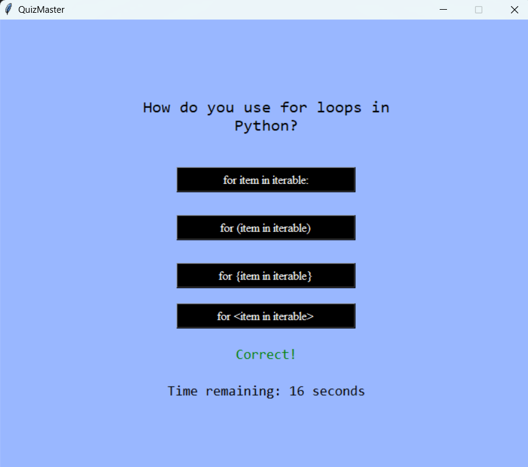
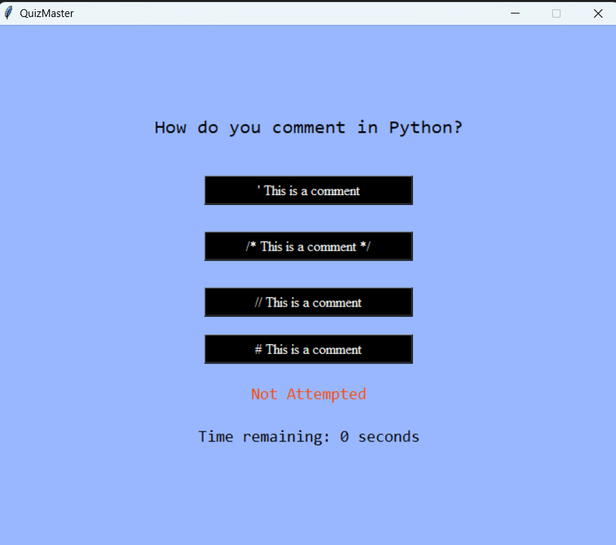
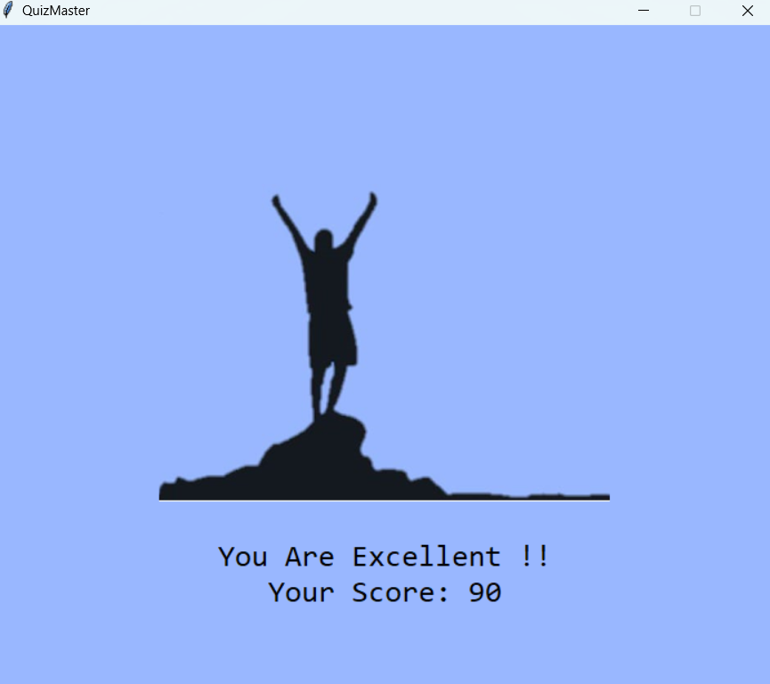

# QuizMaster Application

The QuizMaster application is a Python-based quiz tool designed to assess users' knowledge of Python programming concepts. It utilizes several technologies to provide an interactive and customizable quiz experience.

## Technologies Used

- **Python**: The core programming language used for developing the application logic and functionalities.
  
- **Tkinter**: A standard GUI library in Python used to create the graphical user interface for the QuizMaster application.
  
- **JSON**: Data serialization format used to store and manage quiz questions and answer options in the `data.json` file.
  
- **Random Module**: Python's built-in module used to shuffle and select random questions from the `data.json` file for each quiz session.

## Features

- **Graphical User Interface (GUI)**: Built using Tkinter, providing a user-friendly interface for quiz interaction.
  
- **Customizable Quiz Content**: Users can modify the `data.json` file to change questions and options, and change the answer list in the QuizMaster.py file allowing flexibility in quiz topics.
  
- **Random Question Selection**: Out of 30 predefined questions, the application randomly selects 10 questions for each quiz session, ensuring variety.
  
- **Scoring System**: Each correctly answered question earns 10 points. At the end of the quiz, the total score is calculated and displayed.
  
- **Performance Evaluation**: Based on the score obtained, the application provides feedback categorizing performance as "You Are Excellent !!" (for score greater than or equal to 90), "You Can Be Better !!" (for score lying between 60 to less than 90), or "You Should Work Hard !!" (for score less than 60).

## Screenshots

### Quiz Interface

### Results Page

## Usage

1. **Download the Application**: Download the `QuizMasterApplication` folder which contains the `QuizMaster.exe` file.
  
2. **Start the Quiz**: Launch the application by clicking the `QuizMaster.exe` file. The quiz will appear in the center of the screen.

3. **Answer Questions**: Respond to the randomly selected questions presented by the application.
  
4. **View Results**: After completing the quiz, view the score and performance feedback to gauge your Python knowledge.

## Customizing Quiz Content

To modify the quiz questions:

- Edit the `data.json` file located in the application directory.
- Update the questions and corresponding options as desired.
- Update the answer list present in QuizMaster.py with correct option for the corresponding question.

## Download

You can download the QuizMaster application executable (`QuizMaster.exe`) or access the source code on [GitHub](https://github.com/Deyparamita/QuizMaster).

---
